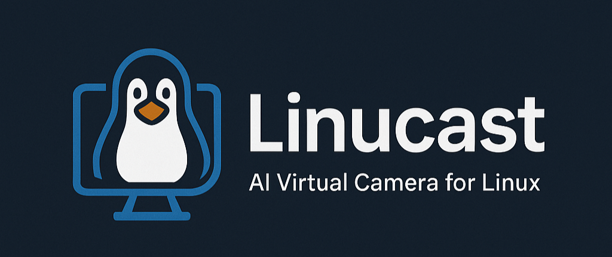

# Linucast - AI Virtual Camera for Linux



### Quick One-Line Installation

For a complete automated installation, run this single command:

```bash
curl -fsSL https://raw.githubusercontent.com/Adelkazzaz/Linucast/main/install/install_wrapper.sh | bash
```

This will:

- Install all required dependencies
- Set up the virtual camera
- Build the C++ components
- Create desktop shortcuts and launcher scripts

### Manual Installation Steps

#### 1. Install Python Dependencies

```bash
# Install required Python packages
pip install mediapipe opencv-python numpy

# Optional: for virtual camera support
pip install pyvirtualcam
```

### 2. Set Up Virtual Camera (Optional)

To use Linucast as a virtual camera for video conferencing:core/assets/linucast-logo.png)

## Overview

Linucast is a Linux virtual camera application that enhances your webcam feed with AI-powered features like face tracking, auto-framing, and background effects. It's designed to be a free, open-source alternative to commercial solutions like NVIDIA Broadcast, optimized specifically for Linux systems.

## ✨ Features

- **Face Tracking & Auto-framing**: Automatically centers and zooms on your face (like Apple Center Stage)
- **Dynamic Zoom Control**: Adjust zoom level in real-time while tracking is active
- **Background Effects**:
  - **Blur**: Apply Gaussian blur to the background
  - **Remove**: Replace background with black
  - **Replace**: Use a custom background image
- **Face Landmarks**: Option to display facial feature points
- **FPS Control**: Toggle between 30 and 60 fps modes for different performance levels
- **Virtual Camera Integration**: Output to a virtual camera for use in video conferencing apps

## 🛠️ Requirements

- Linux system (tested on Ubuntu 20.04+)
- Python 3.8 or higher
- Webcam
- v4l2loopback (for virtual camera output)

## 📋 Dependencies

- MediaPipe
- OpenCV
- NumPy
- pyvirtualcam (optional, for virtual camera output)

## 🚀 Installation

### Quick One-Line Installation

For a complete automated installation, run this single command:

```bash
curl -fsSL https://raw.githubusercontent.com/Adelkazzaz/Linucast/main/install/install_wrapper.sh | bash
```

This will:

- Install all required dependencies
- Set up the virtual camera
- Build the C++ components
- Create desktop shortcuts and launcher scripts

### Manual Installation

#### 1. Install Python Dependencies

```bash
# Install required Python packages
pip install mediapipe opencv-python numpy

# Optional: for virtual camera support
pip install pyvirtualcam
```

### 2. Set Up Virtual Camera (Optional)

To use Linucast as a virtual camera for video conferencing:

```bash
# Install v4l2loopback
sudo apt install v4l2loopback-dkms

# Load the kernel module
sudo modprobe v4l2loopback devices=1 video_nr=10 card_label="LinucastCam" exclusive_caps=1
```

To make the virtual camera persistent across reboots:

```bash
echo "v4l2loopback" | sudo tee -a /etc/modules
echo "options v4l2loopback devices=1 video_nr=10 card_label=LinucastCam exclusive_caps=1" | sudo tee -a /etc/modprobe.d/v4l2loopback.conf
```
```

## 🎮 Usage

### Basic Usage

```bash
python linucast_simple.py
```

### With Face Tracking Enabled

```bash
python linucast_simple.py --face-tracking
```

### With High-Performance Settings

```bash
python linucast_simple.py --face-tracking --landmarks --mode blur --fps 60
```

### With Virtual Camera Output

```bash
python linucast_simple.py --face-tracking --virtual-cam
```

### Full Features Example

```bash
python linucast_simple.py --face-tracking --landmarks --mode blur --virtual-cam --fps 60 --zoom-ratio 1.5
```

## ⌨️ Keyboard Controls

| Key      | Action                                     |
|----------|-------------------------------------------|
| C        | Switch camera                             |
| B        | Blur background mode                      |
| R        | Remove background mode                    |
| I        | Image background mode                     |
| L        | Toggle face landmarks display             |
| T        | Toggle face tracking auto-frame           |
| +/-      | Increase/decrease zoom (tracking mode)    |
| F        | Toggle between 30fps and 60fps modes      |
| Q or ESC | Quit                                      |

## 🔧 Command-Line Options

| Option               | Description                                    | Default   |
|----------------------|------------------------------------------------|-----------|
| --camera CAMERA      | Camera index                                   | 1         |
| --blur BLUR          | Blur strength                                  | 55        |
| --threshold THRESHOLD| Segmentation threshold (0.0-1.0)               | 0.6       |
| --landmarks          | Show face landmarks                            | False     |
| --resolution RES     | Output resolution (e.g., 640x480)              | 640x480   |
| --virtual-cam        | Output to virtual camera                       | False     |
| --virtual-device DEV | Virtual camera device                          | /dev/video10 |
| --bg-image IMAGE     | Background image for replacement mode          | None      |
| --mode MODE          | Background mode (blur, remove, replace)        | blur      |
| --face-tracking      | Enable face tracking and auto-framing          | False     |
| --zoom-ratio RATIO   | Zoom ratio for face tracking                   | 1.8       |
| --smoothing FACTOR   | Smoothing factor for tracking (0.05-0.5)       | 0.2       |
| --fps FPS            | Target FPS (30 or 60)                          | 30        |

## 🔍 Troubleshooting

### Face Tracking Issues

- If tracking is jittery, try decreasing the smoothing factor
- If tracking is too slow, try increasing the smoothing factor
- If the face appears cut off, try decreasing the zoom ratio
- If face tracking is lost during fast movements, the app now has improved recovery mechanisms

### Performance Issues

- Try a lower resolution: `--resolution 640x360`
- Disable face landmarks if not needed
- The app includes adaptive frame skipping to maintain responsiveness when the CPU is heavily loaded
- For best FPS, ensure your system has sufficient resources (CPU, GPU)

### FPS Counter Shows Lower Than Expected

- The FPS counter shows the actual processing framerate, which might be lower than the target due to:
  - Complex processing operations (face detection, background segmentation)
  - System load from other applications
  - Camera hardware limitations
- The app adaptively manages processing to maintain smooth video even when the full target FPS can't be reached

## How Face Tracking Works

The face tracking feature implements a "virtual pan-tilt-zoom" effect:

1. **Detect Face**: Uses MediaPipe Face Mesh to detect facial landmarks
2. **Calculate Center**: Finds the midpoint between the eyes
3. **Smart Tracking**: Adaptively adjusts tracking speed based on movement and FPS
4. **Face Recovery**: Maintains last known position when face detection is temporarily lost
5. **Smooth Movement**: Applies an Exponential Moving Average (EMA) filter with adaptive smoothing
6. **Crop and Zoom**: Creates a zoomed view centered on the face (with adjustable zoom level)
7. **Resize to Output**: Scales the cropped region back to full size
8. **Dynamic FPS Control**: Adjusts the processing rate between standard (30fps) and high (60fps) modes
9. **Adaptive Performance**: Balances image quality and responsiveness based on system capabilities

## 📝 Project Status

This project is fully functional and ready for use. Future updates may include:
- GUI interface for easier control
- More background effects
- Multi-face tracking
- Performance optimizations

## 📄 License

This project is licensed under the Apache License 2.0.

```bash
cd python_core
poetry run linucast
```

### Headless Mode

```bash
cd python_core
poetry run linucast --nogui --input /dev/video0 --output /dev/video10
```

### Command Line Options

```bash
linucast [OPTIONS]

Options:
  --config FILE        Configuration file path
  --nogui             Run without GUI (headless mode)
  --input DEVICE      Input camera device (default: /dev/video0)
  --output DEVICE     Output virtual device (default: /dev/video10)
  --gpu N             GPU device index (default: 0)
  --debug             Enable debug logging
  --help              Show help message
```

## ⚙️ Configuration

Linucast uses a YAML configuration file. See `python_core/config.yaml` for all options:

```yaml
camera:
  device: /dev/video0
  resolution: [1280, 720]
  fps: 30

background:
  mode: blur  # Options: blur, replace, none
  replacement_image: ""

face_tracking:
  smoothing: true
  lock_identity: true
  min_similarity: 0.65

ai:
  device: auto  # auto, cpu, cuda, rocm
  face_detection:
    model: mediapipe
    confidence_threshold: 0.5
  background_segmentation:
    model: modnet  # modnet, mediapipe
    model_path: "models/modnet.onnx"
```

## 📁 Project Structure

```

Linucast/
├── cpp_core/                    # High-performance C++ backend
│   ├── include/                 # Header files
│   │   ├── processor.hpp
│   │   └── kalman.hpp
│   ├── src/                     # Source files
│   │   ├── main.cpp
│   │   ├── processor.cpp
│   │   ├── kalman.cpp
│   │   └── bridge.cpp           # Python bindings
│   ├── CMakeLists.txt
│   └── models/                  # ONNX models for C++
│
├── python_core/                 # Python AI logic + GUI
│   ├── linucast/               # Main Python package
│   │   ├── ai/                  # AI components
│   │   │   ├── face_detector.py
│   │   │   ├── face_id.py
│   │   │   └── segmenter.py
│   │   ├── gui/                 # PyQt6 GUI
│   │   │   └── main_window.py
│   │   ├── ipc/                 # Python↔C++ communication
│   │   │   └── bridge.py
│   │   └── __main__.py          # Entry point
│   ├── config.yaml              # Configuration
│   └── pyproject.toml           # Poetry project file
│
├── tools/                       # Helper scripts
│   └── export_modnet.py         # ONNX model export
│
├── models/                      # Pre-trained models
│   ├── arcface.onnx
│   └── modnet.onnx
│
├── install/                     # Installation scripts
│   ├── install_deps.sh
│   ├── build_cpp.sh
│   └── setup_v4l2loopback.sh
│
└── docs/                        # Documentation
    ├── SRS.md
    └── helpers.md
```

## 🎯 Usage in Video Conferencing

1. **Start Linucast:**

```bash
   cd python_core
   poetry run linucast
   ```

2. **Configure your settings** in the GUI:
   - Select background mode (blur/replace/none)
   - Adjust face detection sensitivity
   - Choose background image (if using replace mode)

3. **In your video conferencing app** (Zoom, Teams, Discord, etc.):
   - Select "Linucast" as your camera device
   - Enjoy AI-enhanced video!

## 🧪 Development

### Building Components

**C++ Backend:**

```bash
cd cpp_core
mkdir build && cd build
cmake .. -DCMAKE_BUILD_TYPE=Debug
make -j$(nproc)
```

**Python Package:**

```bash
cd python_core
poetry install --with dev
poetry run pytest tests/
```

### Adding New Models

1. Export your model to ONNX format
2. Place in `models/` directory
3. Update configuration in `config.yaml`
4. Modify the appropriate AI component in `python_core/linucast/ai/`

## 🤝 Contributing

We welcome contributions! Please see our [Contributing Guide](docs/CONTRIBUTING.md) for details.

1. Fork the repository
2. Create a feature branch
3. Make your changes
4. Add tests
5. Submit a pull request

## 📋 Requirements

### System Requirements

- **OS:** Ubuntu 20.04+ (other Linux distributions may work)
- **RAM:** 4GB minimum, 8GB recommended
- **CPU:** Multi-core processor (4+ cores recommended)
- **GPU:** Optional but recommended for best performance
  - NVIDIA GPU with CUDA 11.0+
  - AMD GPU with ROCm support
  - Intel GPU with OpenVINO

### Performance Targets

- **GPU systems:** ≥30 FPS at 720p
- **CPU-only systems:** ≥15 FPS at 720p (with fallback models)
- **Latency:** ≤50ms end-to-end processing time

## 🔧 Troubleshooting

For detailed troubleshooting information, please see our [Troubleshooting Guide](docs/TROUBLESHOOTING.md).

### Common Issues

- **Virtual camera not detected** - Check v4l2loopback setup
- **Performance issues** - Adjust resolution, processing options
- **Face tracking problems** - Tune sensitivity and smoothing parameters
- **Python module errors** - Rebuild components or check dependencies

### Debug Mode

Enable detailed logging:

```bash
poetry run linucast --debug
```

Check log files in `logs/linucast.log`.

## � License Information

This project is licensed under the Apache License 2.0 - see the [LICENSE](LICENSE) file for details.

## 🙏 Acknowledgments

- [MediaPipe](https://github.com/google/mediapipe) - Face detection and segmentation
- [MODNet](https://github.com/ZHKKKe/MODNet) - Background matting
- [InsightFace](https://github.com/deepinsight/insightface) - Face recognition
- [OpenCV](https://opencv.org/) - Computer vision library
- [v4l2loopback](https://github.com/umlaeute/v4l2loopback) - Virtual camera driver

## 🔗 Links & Documentation

- [Documentation Home](docs/README.md)
- [Installation Guide](docs/INSTALLATION.md)
- [Usage Guide](docs/USAGE.md)
- [Troubleshooting Guide](docs/TROUBLESHOOTING.md)
- [Contributing Guide](docs/CONTRIBUTING.md)
- [Issue Tracker](https://github.com/Adelkazzaz/Linucast/issues)
- [Discussions](https://github.com/Adelkazzaz/Linucast/discussions)
- [Releases](https://github.com/Adelkazzaz/Linucast/releases)

---

**Linucast** - Bringing professional AI camera effects to Linux! 🎥✨
