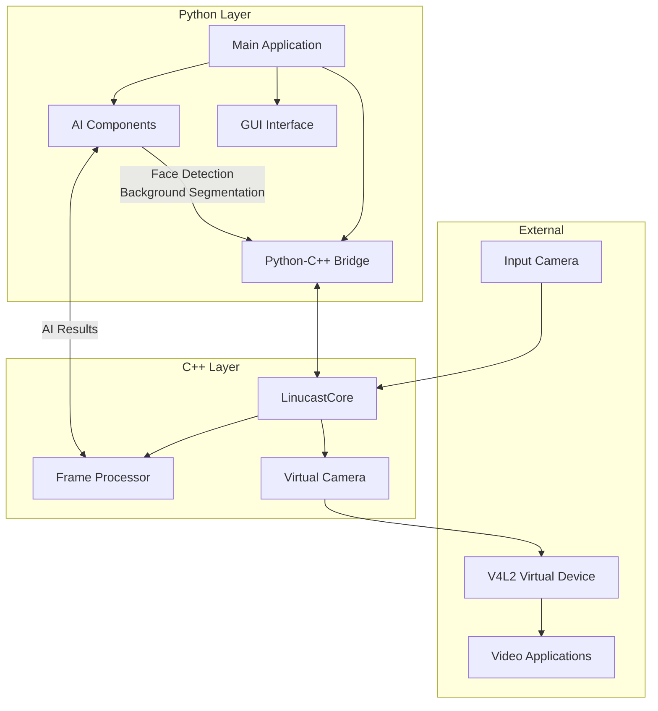
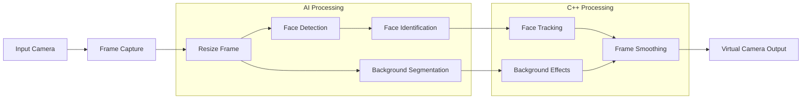
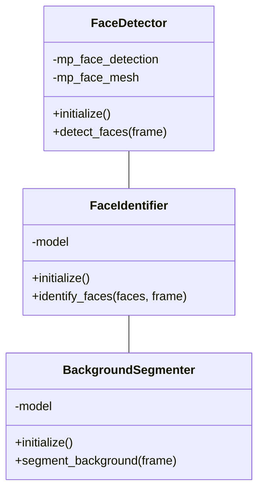
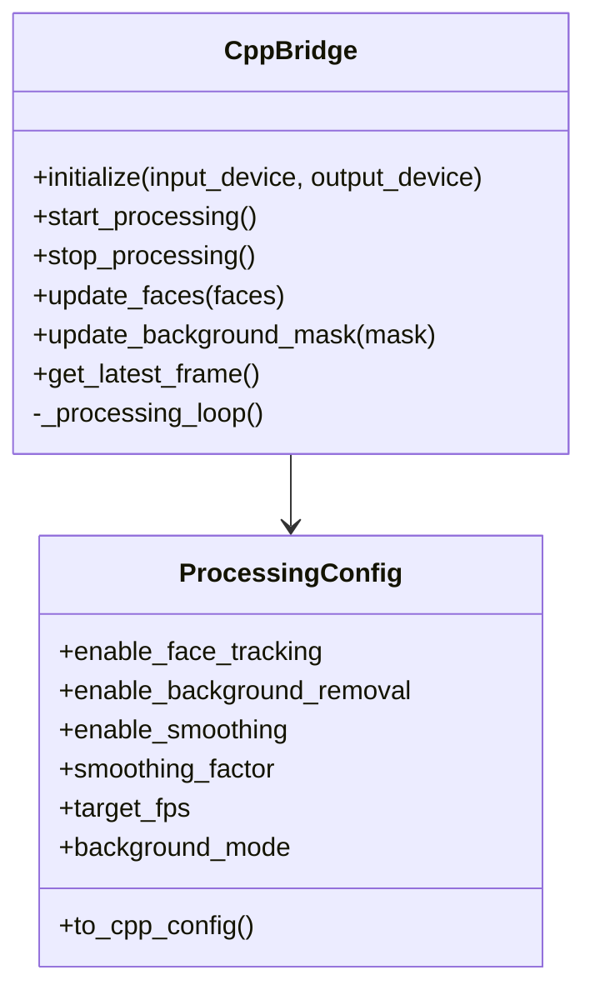
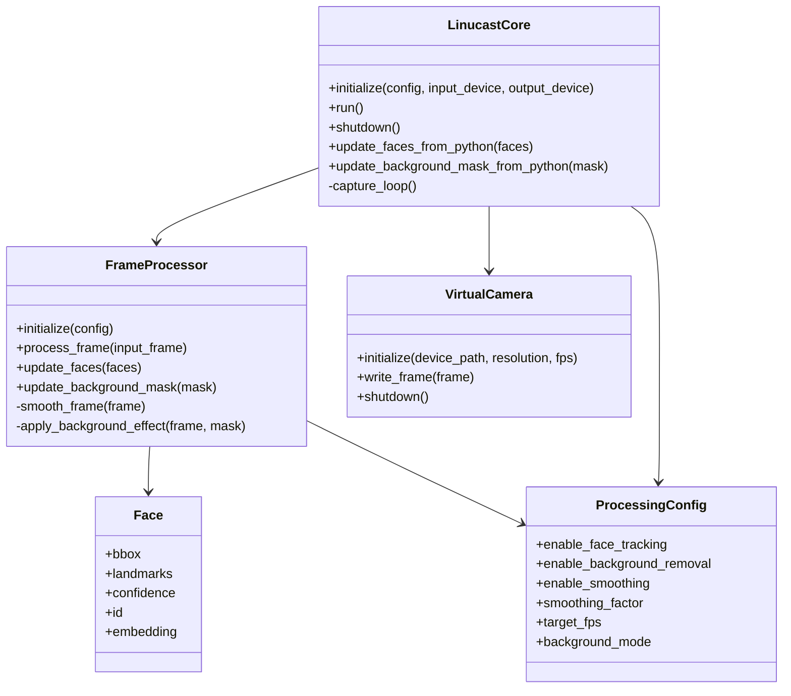
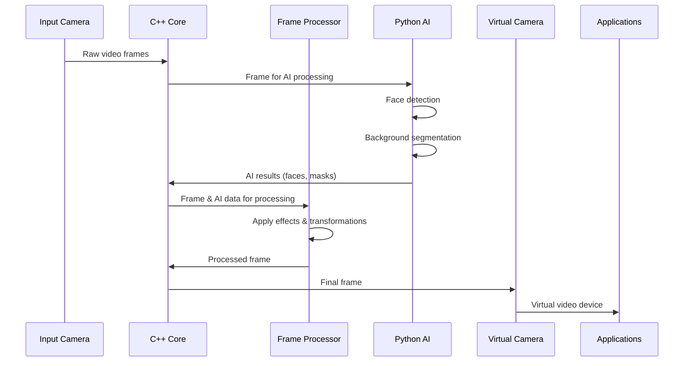
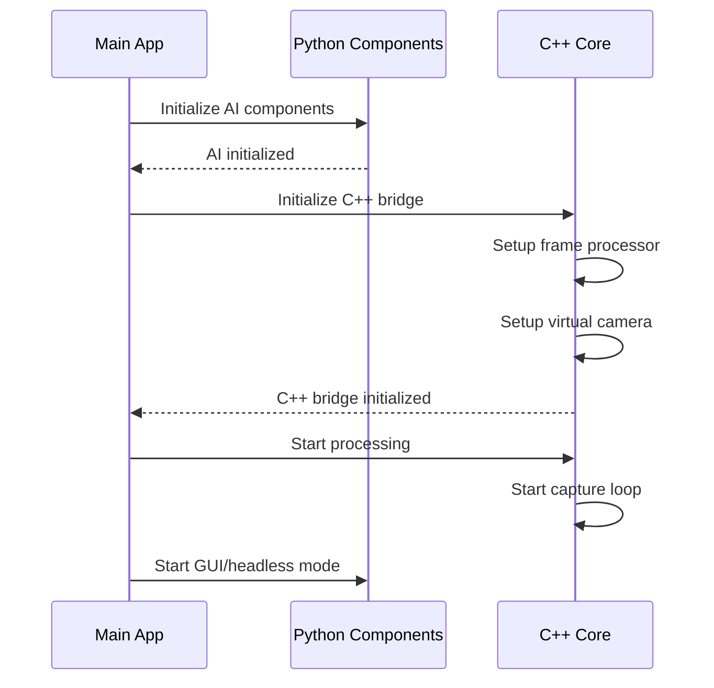
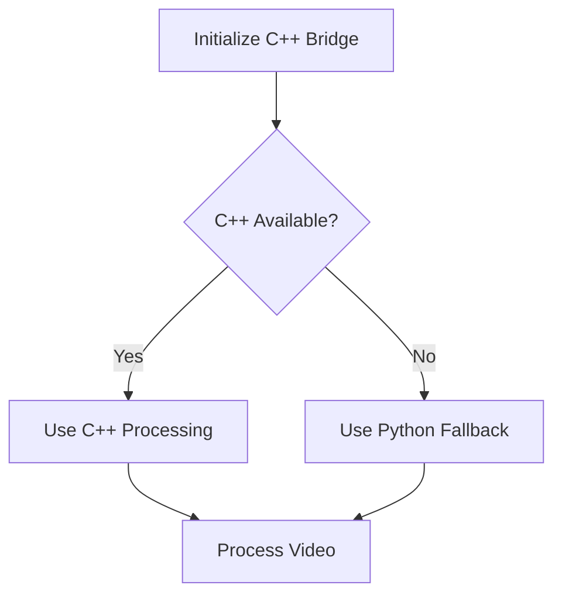
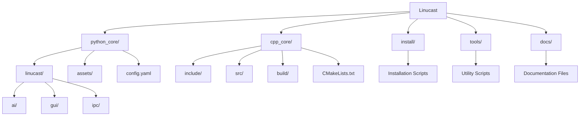
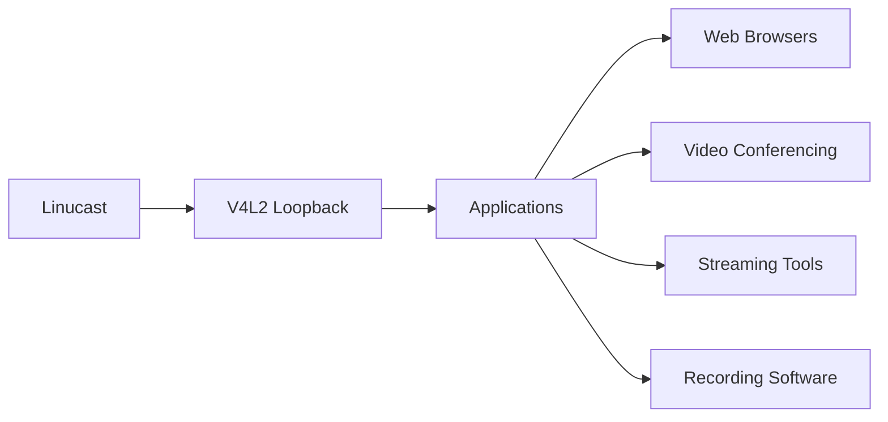

# Linucast Architecture

This document describes the architecture of Linucast, an AI-powered virtual camera system for Linux.

## Overview

Linucast is designed with a hybrid architecture that combines Python for AI components and C++ for high-performance video processing. This hybrid approach leverages the strengths of each language:

- **Python**: Used for AI models, GUI, and overall application management
- **C++**: Used for high-performance video processing and virtual camera integration

## System Architecture

## Processing Pipeline

## Component Details

### Python Components

#### AI Module

The AI module contains three main components:

#### Bridge Architecture

The bridge module manages the communication between Python and C++:

### C++ Components

#### Core Processing Architecture

## Data Flow

## Initialization Sequence

## Fallback Mechanism

## Project Structure

## Integration with External Applications

Linucast integrates with external applications through the V4L2 loopback virtual camera module, allowing processed video to be used with any application that supports standard camera devices.

## Conclusion

The hybrid architecture of Linucast combines the flexibility and AI capabilities of Python with the performance benefits of C++. This design enables high-performance video processing while leveraging advanced AI models for features like face detection and background segmentation.
